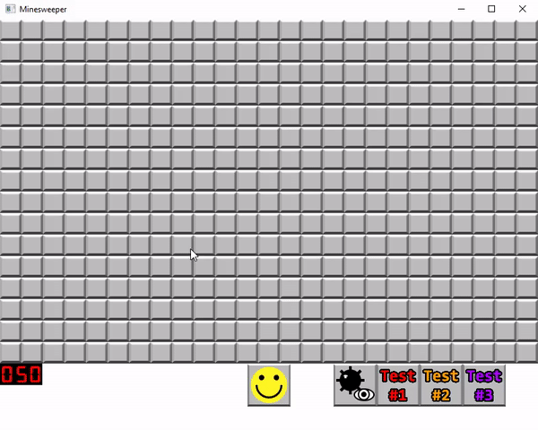

# Fully functional Minesweeper Game
The details of this project - as far as what features the game should contain - were provided by the University of Florida, along with all the image textures used.

---
### What it looks like

### This game has three states

- Game Play State: the player is free to interact with all the tiles on the board
- Winner Game State: all mines are automatically flagged and the player must click the happy face with glasses to reset the board
- Loser Game State: all mines on the board are revealed and the player must click the sad happy face to reset the board

### Features

- Tiles are revealed when left-clicked and are assigned a number that corresponds to the number of mines adjacent to this tile.
- Mines are randomly placed in tiles across the board - depending on the mine counter - and if left-clicked, the player loses and is sent to the loser game state.
- Mine counter (bottom-left of screen) indicating the number of mines on the board, which changes depending on the number of flags placed.
- Unrevealed tiles are flagged and unflagged when right-clicked, which updates the mine counter, respectively.
- Tiles with no adjacent mines do not have a number assigned to them.
- If a tile is revealed and it has zero mines adjacent to it, all neighboring tiles with zero adjacent mines will also be automatically revealed, along with the corresponding neighbors of those revealed tiles.
- Button with a yellow face that resets the board when left-clicked and changes depending on the state of the game.
- Button with a mine and an eye that reveals all the mines on the board when left-clicked the first time and hides all the mines when left-clicked again.
- Three buttons for testing, each creating a unique board based on the config file assigned to it, which can be modified freely.

### Other features

- config.cfg (found in the "boards" folder) determines the board's number of columns (lines 1), rows (line 2), and mines (line 3). You are free to modify these values.
- testboard#.brd are also found in the same "boards" folder and contains a version of the board in 0's (representing non-mine tiles) and 1's (representing mines).
- The board will reflect any changes made to these files when the program is freshly run.

### Build instructions

- Clone and run on a C++ compiler.
